## What does the NASA HSI Handbook look like?
- Official name is *NASA/SP-20210010952*
- Freely downloadable at <https://ntrs.nasa.gov/citations/20210010952>
- You are encouraged to download it and **at least skim through it!**

## Why do we care about NASA?
- There is also the INCOSE HSI Primer, the US Air Force HSI Handbook...
- NASA has developed some of the most complex systems in extreme situations out of Earth, including non-human spaceflights (e.g., Mars rovers)
- When studied carefully, the NASA methods can be utilized in Earth environments for great HSI and architecture benefits:
  - Cost savings
  - Safety
  - Time savings
  - Resiliency
  - Durability
  - Sustainability
  - ...

## What does the NASA HSI Handbook look like?
:::: {.columns}

::: {.column width="30%"}
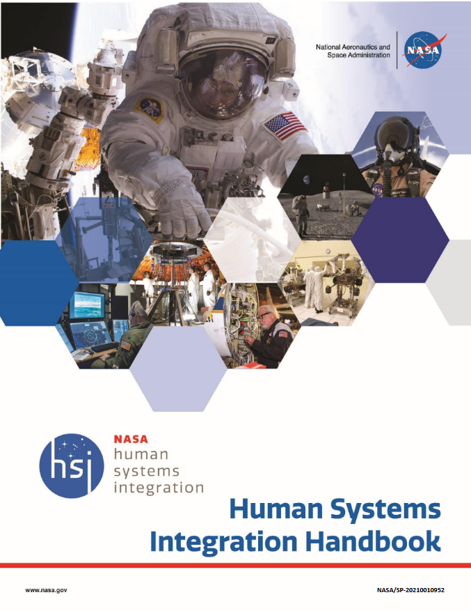
:::

::: {.column width="35%"}
**First half = main body** \

HSI Fundamentals \
HSI Impacts \
HSI Resources at NASA \
HSI Implementation
:::

::: {.column width="35%"}
**Second half = appendices** \

HSI Plan \
HSI in the Project Life Cycle \
HSI in Safety \
HSI Case Studies \
HSI Tools \
HSI Data Requirements \
HSI (more) Resources
:::

::::

## What does the NASA HSI Handbook look like?
:::: {.columns}

::: {.column width="30%"}

:::

::: {.column width="35%"}
**First half = main body** \

[HSI Fundamentals]{style="color: red;"} \
[HSI Impacts]{style="color: red;"} \
HSI Resources at NASA \
[HSI Implementation]{style="color: red;"}
:::

::: {.column width="35%"}
**Second half = appendices** \

[HSI Plan]{style="color: red;"} \
[HSI in the Project Life Cycle]{style="color: red;"} \
HSI in Safety \
[HSI Case Studies]{style="color: red;"} \
HSI Tools \
HSI Data Requirements \
HSI (more) Resources
:::

::::

# HSI Fundamentals
## HSI Fundamentals - HSI Goal
The goals of HSI is:

:::: {style="text-align: center;"}

::: {style="padding: 100px"}
**"To optimize total system performance through effective human integration with  hardware and software while minimizing program costs and risks."**
:::

::::

## HSI Fundamentals - Brief History
- Since early 60s, NASA used HF principles with focus on human health and performance
- 1965: First "HSI Standard" (MSFC-STD-391 Human Factors Engineering Program) where term HSI comes from
- 2013: NPR 7123.1B NASA System Engineering Processes and Requirements publish the first formal definition of HSI for NASA
- 2015: NASA HSI Practitioner's Guide (HSIPG) published, provides HSI methods to teams coordination and HSI implementation throughout the product lifecyle, including a template for the **HSI Plan**
- 2021: Latest version of the HSI Handbook

## HSI Fundamentals - HSI Definition
:::: {style="text-align: center;"}

::: {style="padding: 100px"}
**"HSI (as a process) is a required interdisciplinary integration of the human as an element of a system to ensure that the human and software/hardware components cooperate, coordinate, and communicate effectively to successfully perform a specific function or mission."**
:::

::::

## HSI Fundamentals - HSI Definition (some remarks)
- At NASA, HSI is part of NASA SE processes
- HSI can be perceived as, and defines:
  - A philosophy
  - An approach to Systems Engineering (SE)
  - A set of processes
  - Mission and goal
- Ideally, each HSI effort (transcribed in the so-called **HSI Plan**) considers all of the above

## HSI Fundamentals - HSI Definition (more remarks)
- "*Human*" here is broad: a human can range from an individual to a group (e.g., a crew, team, unit or organization)
- "*Human*" is not only the end-user of your system, but, as the Handbook puts it:

:::: {style="text-align: center;"}

::: {style="padding: 100px"}
**"The human in HSI refers to all personnel involved with a given system, including owners, users, customers, designers, operators, maintainers, assemblers, support personnel, logistics suppliers, training personnel, test personnel, and others"**
:::

::::

## HSI Fundamentals - HSI Domains
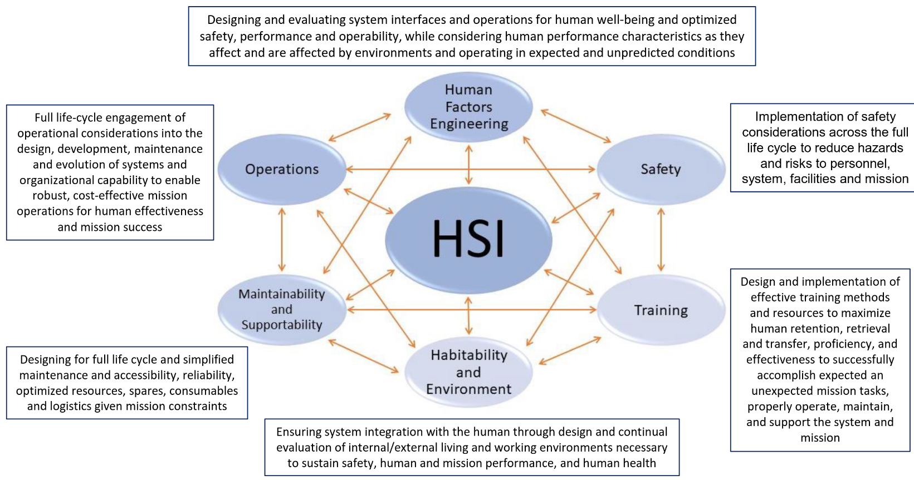

## HSI Fundamentals - Human Factors Engineering
- TODO

## Example: The Cost of Untested Assumptions About Human Performance: The case of the B737MAX {background-color="#3c405c"}
:::: {.columns}

::: {.column width="85%"}
- D.8 blablablablablablablablablablablablablablablablablablablablabla
:::

::: {.column width="15%"}
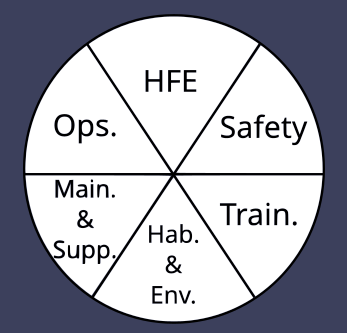{width="100%"}
:::

::::

## Example: The Cost of Untested Assumptions About Human Performance: The case of the B737MAX {background-color="#3c405c"}
:::: {.columns}

::: {.column width="85%"}
- D.8 blablablablablablablablablablablablablablablablablablablablabla
:::

::: {.column width="15%"}
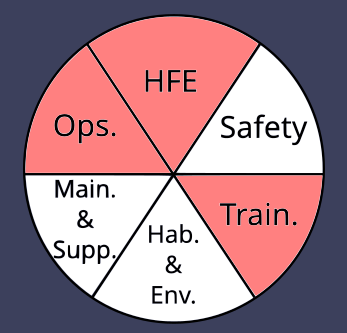{width="100%"}
:::

::::

## HSI Fundamentals - Operations
- TODO

## HSI Fundamentals - Maintainability and Supportability
- TODO

## Example: Inadequate Consideration of Operations During Design: Shuttle Ground Processing {background-color="#3c405c"}
:::: {.columns}

::: {.column width="85%"}
- D.1 blablablablablablablablablablablablablablablablablablablablabla
:::

::: {.column width="15%"}
{width="100%"}
:::

::::

## Example: Inadequate Consideration of Operations During Design: Shuttle Ground Processing {background-color="#3c405c"}
:::: {.columns}

::: {.column width="85%"}
- D.1 blablablablablablablablablablablablablablablablablablablablabla
:::

::: {.column width="15%"}
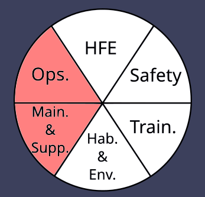{width="100%"}
:::

::::

## HSI Fundamentals - Habitability and Environment
- TODO

## Example: Expert Knowledge of Human Performance Resulted in Effective Countermeasure for Launch Vehicle Display Vibration {background-color="#3c405c"}
:::: {.columns}

::: {.column width="85%"}
- D.3 blablablablablablablablablablablablablablablablablablablablabla
:::

::: {.column width="15%"}
{width="100%"}
:::

::::

## Example: Expert Knowledge of Human Performance Resulted in Effective Countermeasure for Launch Vehicle Display Vibration {background-color="#3c405c"}
:::: {.columns}

::: {.column width="85%"}
- D.3 blablablablablablablablablablablablablablablablablablablablabla
:::

::: {.column width="15%"}
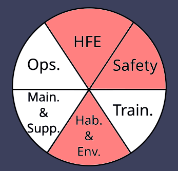{width="100%"}
:::

::::

## HSI Fundamentals - Safety
- TODO

## HSI Fundamentals - Training
- TODO

# HSI Impacts

## HSI Impacts - Overall Effects
### Successful HSI application results in:
- Improves safety and health, including fewer accidents and less lost time
- User satisfaction, trust, and loyalty, which increase the probability of mission success
- Ease of use, resulting in reduced incidence of user errors and higher resilience (error recovery)
- Ease of learning, together with reduced training time
- Higher productivity and work effectiveness

## HSI Impacts - Overall Effects
### Failure to apply HSI results in greater potential for:
- Risk to human life, which could terminate the current mission and threaten future missions 
- Risk of major accidents that threaten missions and significantly increase cost
- Mishaps, injuries, and illnesses that reduce mission effectiveness and threaten success
- Higher error rates
- Greater training burden—time and personnel
- Increased development costs
- Costly redesigns and operational workarounds
- Higher maintenance support and service costs

## HSI Impacts - Life-Cycle Cost Effect of HSI
:::: {.columns}

::: {.column width="60%"}
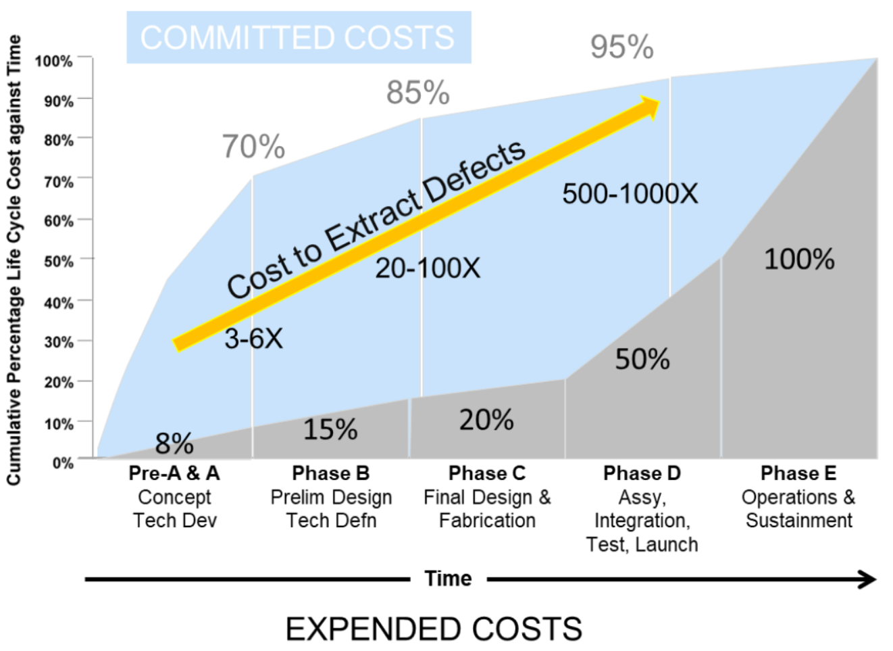
:::

::: {.column width="35%"}
- Example in DoD: much of unplanned cost growth due to personnel costs in systems operations phase - i.e., operating, maintaining, and logistically supporting systems required more people and skills than expected
- Properly applying HSI processes should reduce LCC by emphasizing efficient human performance goals in system operations
:::

::::

## HSI Impacts - Return on Investment
- Short-term focus can lead on-shedule and on-budget performances, *but* system may be suboptimal that cannot be deployed safely and effectively without costly corrections and rework
- The *earlier* an HSI investment can be made, the *greater* its return

## Example: Implications of Instrument Design Choice {background-color="#3c405c"}
:::: {.columns}

::: {.column width="22%"}

:::

::: {.column width="63%"}
- Curiosity Rover runs a full Martian day of commands without real-time monitoring
- Instruments can be damaged by direct sun exposure
- Rover's protective cover was removed due to risk of actuator failure that could disable the instrument
- Without the cover, teams must analyze every planned observation for sun safety, adding time and workload
- Initially a manual process; later improved with ground-software tools and on-board protections
- Design change increased operating costs and risks of damage
:::

::: {.column width="15%"}
{width="100%"}
:::

::::

## Example: Implications of Instrument Design Choice {background-color="#3c405c"}
:::: {.columns}

::: {.column width="22%"}

:::

::: {.column width="63%"}
- Curiosity Rover runs a full Martian day of commands without real-time monitoring
- Instruments can be damaged by direct sun exposure
- Rover's protective cover was removed due to risk of actuator failure that could disable the instrument
- Without the cover, teams must analyze every planned observation for sun safety, adding time and workload
- Initially a manual process; later improved with ground-software tools and on-board protections
- Design change increased operating costs and risks of damage
:::

::: {.column width="15%"}
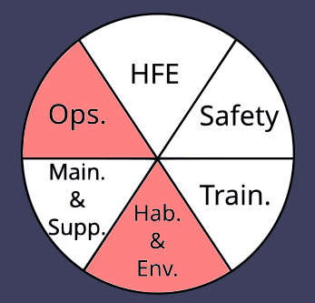{width="100%"}
:::

::::

## HSI Impacts - HSI in Trade Studies
- In HSI, HSI Domains for a system satisfied within the constraints of performance, LCC, and development/delivery schedule
- Systems in HSI are complex, and may require a variety of context specific HSI trade-offs
- Decision‐makers use trade studies throughout the project life cycle to select the most acceptable solution from a set of proposed solutions
- A trade-off study is not done just once at the beginning of a project.
- Trade-offs are made continually throughout a project, when creating team communication methods, selecting components, choosing implementation techniques, designing test programs, and maintaining schedules

## Example: Reliable and Maintainable F-119 Engine {background-color="#3c405c"}
:::: {.columns}

::: {.column width="85%"}
- USAF ATF program emphasized RM&S to curb rising logistics costs (>50% of USAF budget)
- Pratt & Whitney (against GE) centered its F-119 engine design on RM&S and maintainer needs, conducting ~200 formal trade studies
- This approach led to: only 11 tool ends total, all replaceable units independent, and 20-minute replacement max
- Engineers directly observed USAF maintenance facilities to enhance design, documentation, diagnostics and tooling
- Full-scale mock-ups validated human–system interaction and maintainability goals (costly, but worth it)

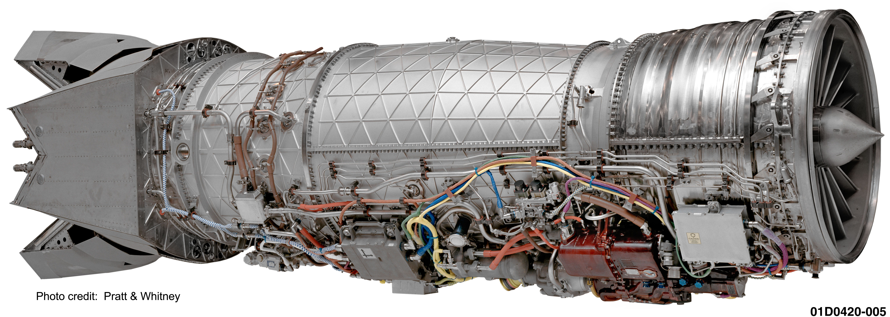{width="35%"}
:::

::: {.column width="15%"}
{width="100%"}
:::

::::

## Example: Reliable and Maintainable F-119 Engine {background-color="#3c405c"}
:::: {.columns}

::: {.column width="85%"}
- USAF ATF program emphasized RM&S to curb rising logistics costs (>50% of USAF budget)
- Pratt & Whitney (against GE) centered its F-119 engine design on RM&S and maintainer needs, conducting ~200 formal trade studies
- This approach led to: only 11 tool ends total, all replaceable units independent, and 20-minute replacement max
- Engineers directly observed USAF maintenance facilities to enhance design, documentation, diagnostics and tooling
- Full-scale mock-ups validated human–system interaction and maintainability goals (costly, but worth it)

{width="35%"}
:::

::: {.column width="15%"}
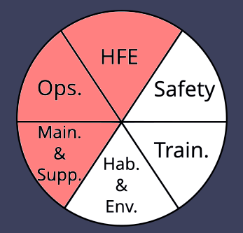{width="100%"}
:::

::::

# HSI Implementation

## HSI Implementation - HSI Practitioners
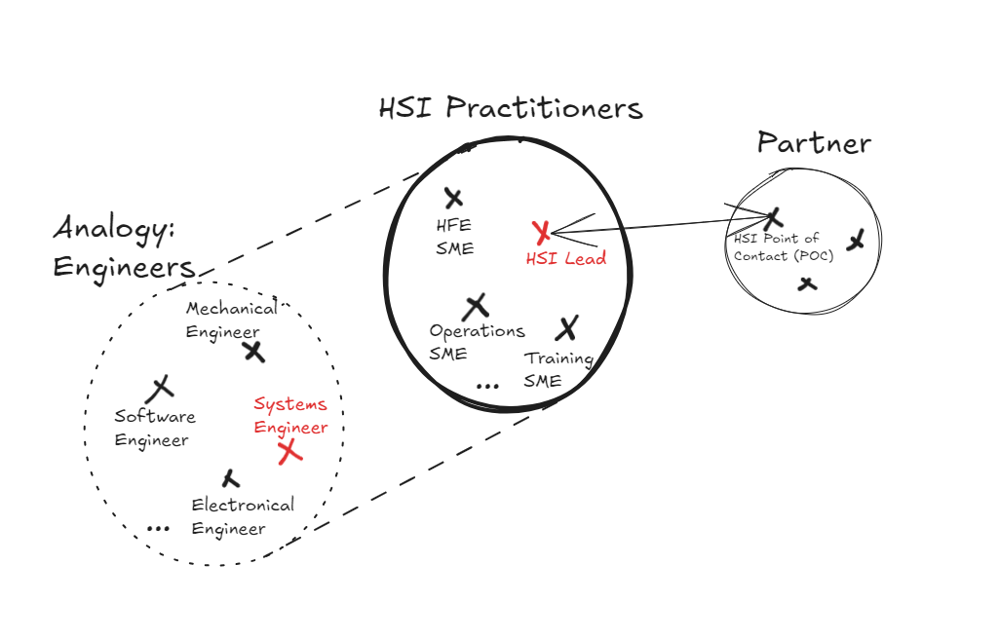{width=80%}

## HSI Implementation - Definitions
- **HSI Practitioner (or SME = Subject Matter Expert)**: Person trained and experienced in HSI domains, integrating the domains capable of identification of interrelationships across domains and multiple technical discipline areas throughout the project / product lifecycle, who participates in execution of HSI Plan/Program
- **HSI Lead**: HSI practitioner highly experienced in HCD execution, system design as integrator participating in project management leading HSI effort, defining HSI scope, mission, budget, schedule as part of the rest of the project throughout its lifecycle (research, design, development and system implementation) as per of SE
- **HSI POC**: Contractor’s HSI representative who is capable of leading HSI efforts within the contractor’s team

## HSI Implementation - Concept of Operations (ConOps)
- TODO

## Example: Training, Simulation, Design and Human Error: The Virgin Galactic Spaceship Two Mishap {background-color="#3c405c"}
:::: {.columns}

::: {.column width="85%"}
- D.5 blablablablablablablablablablablablablablablablablablablablabla
:::

::: {.column width="15%"}
{width="100%"}
:::

::::

## Example: Training, Simulation, Design and Human Error: The Virgin Galactic Spaceship Two Mishap {background-color="#3c405c"}
:::: {.columns}

::: {.column width="85%"}
- D.5 blablablablablablablablablablablablablablablablablablablablabla
:::

::: {.column width="15%"}
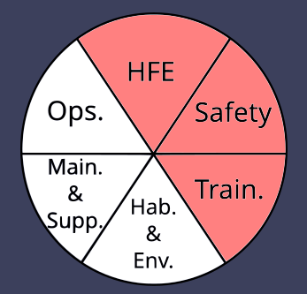{width="100%"}
:::

::::

## HSI Implementation - Function Allocation
- TODO

## HSI Implementation - Task Analyses
- TODO

# HSI in the Project Life Cycle
## HSI in the Project Life Cycle
- See Ondrej from 44 through 50

# HSI Plan
## HSI Plan - What is it?
- An HSI Plan is written at the beginning of a project or program, and describes how HSI will be conducted in the project or program
- The HSI Plan contains:
  - Steps to HSI implementation
  - Metrics to control HSI implementation
  - The definition of the HSI Domains (may differ from the six we have seen at NASA)
  - The description of the organizational structure and stakeholders regarding HSI implementation (i.e., who does what)
  - The description of which HSI methods will be used
- The HSI Plan stays at a relatively high level (we don't describe low-level design choices for instance)
- HSI Planning starts **before Pre-A Phase**. HSI team develops HSIP draft **during Pre-A Phase**

## HSI Plan - Where do I find one?
- You will find the HSI Plan template proposed by NASA in Appendix A of the Handbook
- For your projects, you will work [on a lightweight version of the HSI Plan](assets/hsi-plan.docx) (more on that later)

## HSI Plan - Outline
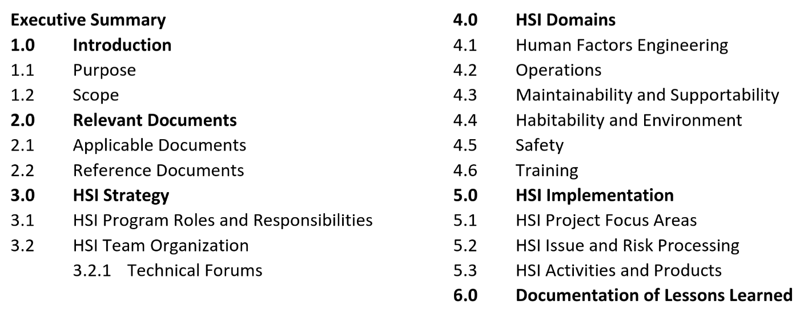

## HSI Plan - Student-friendly version
- TODO

